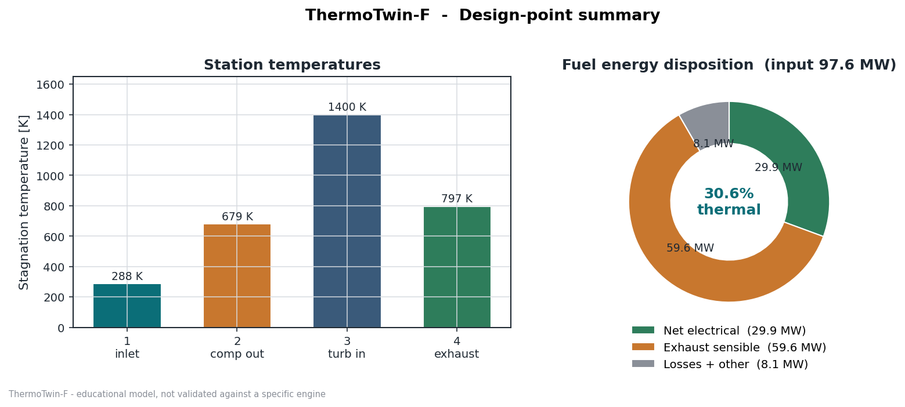
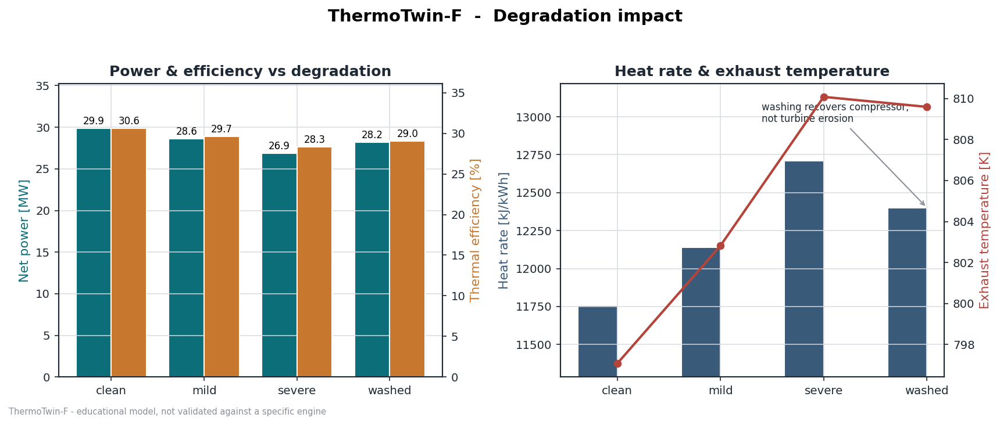
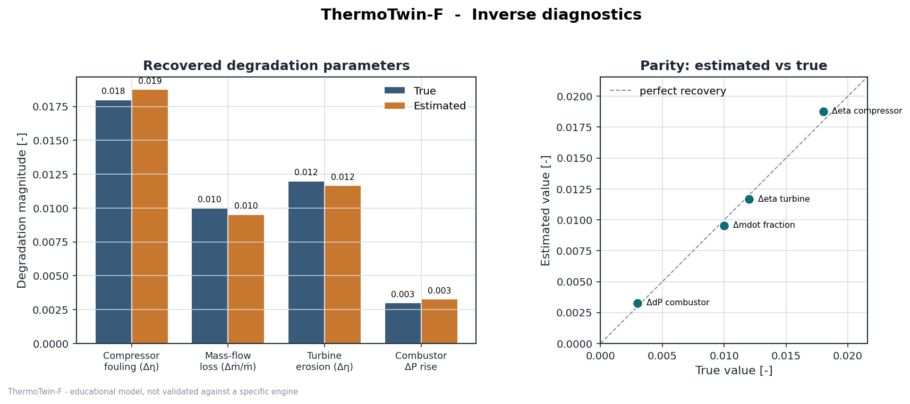
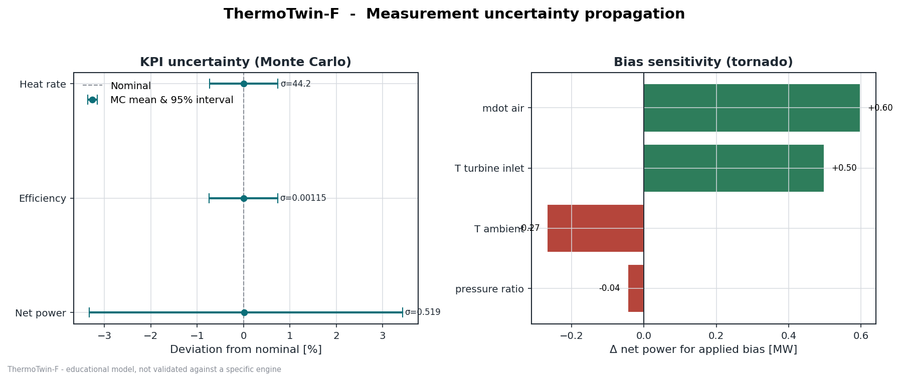

# ThermoTwin-F

[](https://github.com/abhijith-sivaprasadan/thermotwin/actions/workflows/ci.yml)
[](LICENSE)
[](https://fortran-lang.org)

**A Modern Fortran gas-turbine and combined-cycle performance simulator —
design, degradation, transient thermal response, measurement uncertainty,
inverse diagnostics, data reconciliation, and OPC UA integration.**

ThermoTwin-F models a single-shaft, open/simple Brayton-cycle gas turbine —
with an optional combined-cycle extension (HRSG + steam bottoming) — and
follows the real workflow of a performance engineer across an engine's life:

1. **Design** — establish the clean design point and its off-design sensitivities.
2. **Monitor** — quantify how fouling, erosion, and pressure losses degrade performance.
3. **Diagnose** — given noisy plant measurements, infer *where* an engine has degraded.

The whole project is built around a single shared data model — one `InputCase`
(machine + operating point) flows in, one `CycleResult` (every station state and
KPI) flows out — so the advanced modules compose coherently instead of being
independent scripts.

## Results at a glance

<table>
<tr>
<td align="center"><b>Design-point cycle</b><br></td>
<td align="center"><b>Degradation impact</b><br></td>
</tr>
<tr>
<td align="center"><b>Inverse diagnostics</b><br></td>
<td align="center"><b>Measurement uncertainty</b><br></td>
</tr>
</table>

---

> **Honesty note.** This is a non-proprietary **educational** simulator built on
> standard textbook thermodynamics with representative property values. It is
> **verified** against an independent hand calculation (`thermotwin selftest`)
> but is **not validated** against any specific commercial engine and is **not**
> ASME PTC 22 / ISO 2314 compliant. Treat the numbers as physically plausible
> illustrations, not predictions for a particular machine. See
> [the consolidated technical report](docs/THERMOTWIN-F_TECHNICAL_REPORT.md).

---

## Quick start

You need a Fortran compiler (`gfortran` ≥ 9) and, for the plots, `python3` with
`numpy` and `matplotlib`.

### Reference path — gfortran + Make

```bash
make
make check
```

See the [verification matrix](docs/verification_matrix.md) for numerical oracles,
tolerances and the stable/experimental boundary.

### Experimental alternative — Fortran Package Manager (unverified)

FPM is not a supported primary path until the expanded engine passes build/test
parity. The retained manifest and commands below are development candidates only.

```bash
fpm build
fpm test
```

The older convenience scripts below have not been reverified against the expanded
engine module set; prefer the Make targets above for the current implementation.

```bash
./scripts/build.sh            # build ./thermotwin
./scripts/run_tests.sh        # build + run all unit tests + selftest
./scripts/run_pipeline.sh     # build, run every mode, make figures + PDF report
```

A `Makefile` is also provided (`make`, `make check`, `make run`, `make debug`).

### See everything at once

```bash
./scripts/run_pipeline.sh
```

This produces all result CSVs in `output/`, six figures in `output/figures/`,
and a multi-page report at `output/ThermoTwin-F_report.pdf`.

### Optional Windows grid-balancing GUI

The repository also includes an early native Windows GUI written in Fortran. It
uses a custom-drawn Win32/GDI dashboard through `iso_c_binding`, links directly
to the simulator modules, and lets you manipulate demand, renewables, storage,
gas dispatch, ambient temperature, and firing temperature while watching live
grid balance, battery state of charge, frequency estimates, reserves, and
rolling time-series traces. The dashboard also includes basic operating
economics and battery ROI estimates, uses buffered GDI rendering to keep timer
updates smooth, and embeds a generated Windows icon for the executable.

```powershell
make gui
.\thermotwin-gui.exe
```

See [`gui/README.md`](gui/README.md) for scope and next steps.

---

## Command-line modes

```
thermotwin run         <input.csv> [output.csv]   solve every row of a case file
thermotwin degradation <baseline.csv>             clean/mild/severe/washed comparison
thermotwin transient   <baseline.csv>             startup/load-ramp/shutdown metal heating
thermotwin uncertainty <baseline.csv>             Monte Carlo + bias-sensitivity study
thermotwin diagnostics <baseline.csv>             recover a known degradation by inversion
thermotwin selftest                               verify against the hand calculation
```

`run` evaluates every operating point in the file (a single design point and a
30-row parameter sweep are handled identically). The scenario modes take the
first row of their file as the baseline machine.

---

## What it computes

- **Cycle solver** — full station-by-station solution (compressor, combustor,
  turbine, shaft/generator) with a rigorous fuel-mass-conserving combustor
  energy balance; outputs power, thermal efficiency, heat rate, exhaust
  temperature and energy, specific power, and a converged/sanity flag.
- **Degradation** — four interpretable knobs (compressor fouling, mass-flow
  loss, turbine erosion, combustor ΔP rise) applied to the clean case and
  re-solved, so all KPI changes are emergent.
- **Transient thermal** — lumped-capacitance metal node driven by the cycle's
  exhaust temperature, integrated with Euler and RK4.
- **Sensor + uncertainty** — bias/noise/drift measurement model, Monte Carlo
  KPI uncertainty, and a deterministic bias-sensitivity tornado.
- **Inverse diagnostics** — weighted least-squares estimation of the degradation
  state from observed KPIs (grid search + coordinate-descent refinement).
- **Combined-cycle bottoming** — single-pressure HRSG (pinch/approach-limited
  0-D heat balance) driving a steam bottoming cycle with a condenser
  back-pressure correlation against ambient temperature.
- **Data reconciliation** — single-constraint weighted least-squares
  reconciliation of redundant noisy measurements, with a chi-square(1) global
  test for gross-error detection.
- **OPC UA integration** — an `iso_c_binding` bridge to `open62541` that writes
  named tag values with engineering units to an OPC UA address space; this is
  an optional GUI-side integration, not covered by core CI (see the
  [verification matrix](docs/verification_matrix.md)).

Representative legacy simple-cycle design-point results: **≈30 MW**, **≈31 % thermal
efficiency**, **≈11 800 kJ/kWh heat rate**, **≈797 K exhaust** — squarely in the
expected band for a simple-cycle machine.

---

## Repository layout

```
thermotwin-f/
├── app/main.f90              CLI driver (all modes)
├── src/                      simulation modules (see below)
├── test/                     unit tests (one program per module) + shared asserts
├── cases/                    CSV inputs + format documentation
├── python/                   matplotlib post-processing + PDF report generator
├── docs/                     theory, equations, verification, limitations, report
├── scripts/                  build.sh, run_tests.sh, run_pipeline.sh
├── output/                   generated CSVs, figures, and the PDF report
├── fpm.toml                  Fortran Package Manager build
├── Makefile                  gfortran build (fpm-free)
└── LICENSE                   MIT
```

### Source modules (dependency order)

`precision_kinds` → `constants` → `types` → `utilities` → `fluid_properties`
→ `ambient` → `compressor` → `combustor` → `turbine` → `shaft_generator`
→ `cycle_solver` → `degradation` → `transient_thermal` → `sensor_model`
→ `uncertainty_analysis` → `diagnostics_solver` → `csv_io` → `sensitivity_driver`.

---

## Documentation

| Document | Contents |
|---|---|
| [`docs/THERMOTWIN-F_TECHNICAL_REPORT.md`](docs/THERMOTWIN-F_TECHNICAL_REPORT.md) | consolidated equations, assumptions, analysis and verification discussion |
| [`docs/REVAMP_7.0.md`](docs/REVAMP_7.0.md) | implementation history; roadmap aspirations are not independent validation |
| [`docs/COMMIT_REVIEW.md`](docs/COMMIT_REVIEW.md) | current checks and remaining verification boundaries |
| [`cases/README.md`](cases/README.md) | input CSV column format |

---

## Design choices worth noting

- **Modern Fortran (2008):** free-form, `implicit none` everywhere, modules and
  derived types, descriptive unit-suffixed variable names, doc comments.
- **One data model:** `InputCase` and `CycleResult` are the contract every
  module speaks, which is what lets degradation/sensors/uncertainty/diagnostics
  interoperate.
- **Switchable fluid properties:** constant `cp`/`γ` by default (so the hand
  calculation is exactly reproducible), with a temperature-dependent option
  behind the same interface.
- **Reproducibility:** the RNG is explicitly seeded, so Monte Carlo studies
  repeat exactly.
- **Tested physics, not just syntax:** unit tests check energy balance,
  monotonic degradation, transient steady-state limits against an analytic
  oracle, and recovery of a known degradation by the inverse solver.

---

## Roadmap

Natural extensions, each building on a stated limitation: real-gas properties by
default · compressor/turbine performance maps · turbine cooling-air bookkeeping ·
a first NOx correlation · a multi-node transient thermal model with stress
output · a Bayesian/Kalman diagnostics formulation.

---

## License

Optional neural-surrogate weights are loaded from `dnn_weights.txt`. Regenerate them
with `python train_dnn.py` (NumPy required). Training targets are synthetic model
outputs, not measured plant observations; surrogate agreement is not external validation.

MIT — see [`LICENSE`](LICENSE).


## Parallel execution and CI

Optional OpenMP batch operating-point evaluation with serial equivalence checks and measured workstation scaling. See [docs/openmp_scaling.md](docs/openmp_scaling.md).

CI runs on Ubuntu, Windows and macOS. ThermoTwin-F uses release/debug profiles and serial/OpenMP builds; PyNEXUS tests Python 3.10, 3.11 and 3.12 and runs a separate Linux MPI equivalence job. Weekly runs check dependency drift. Hosted run status is available in the repository’s Actions tab; documented local measurements are separate from hosted verification.
