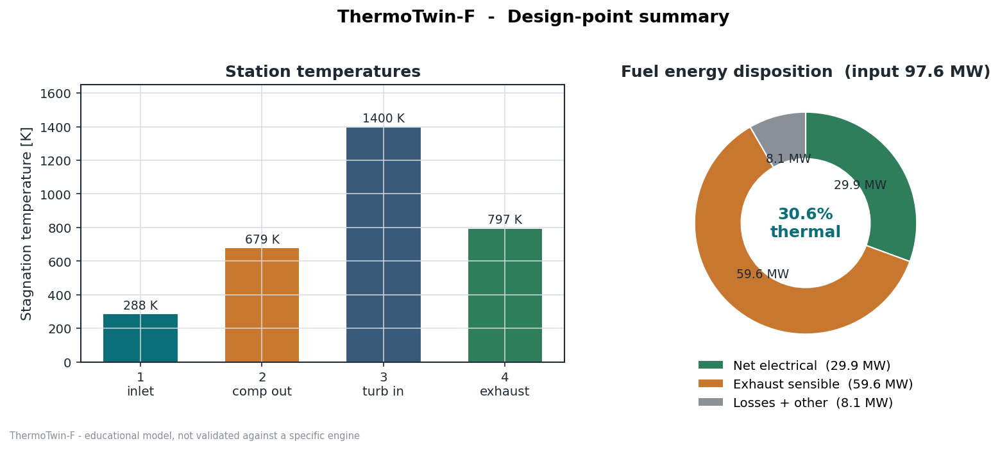
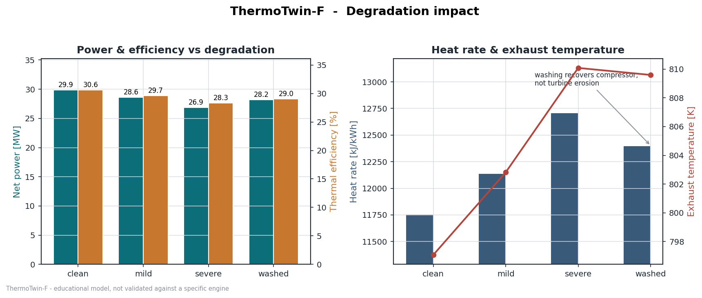
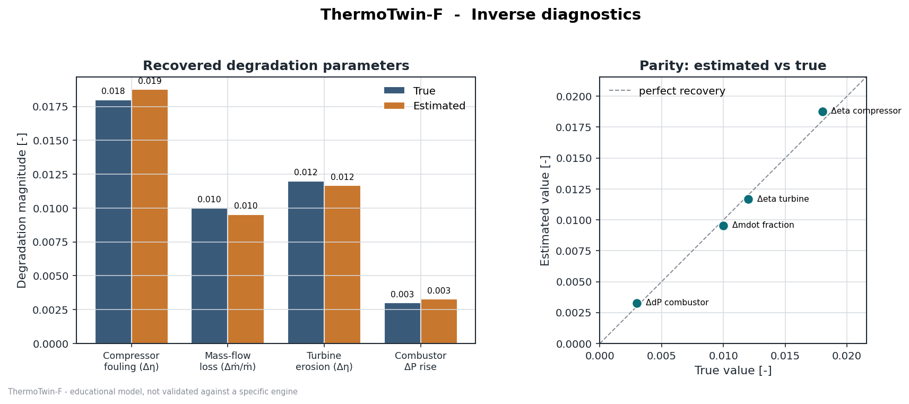
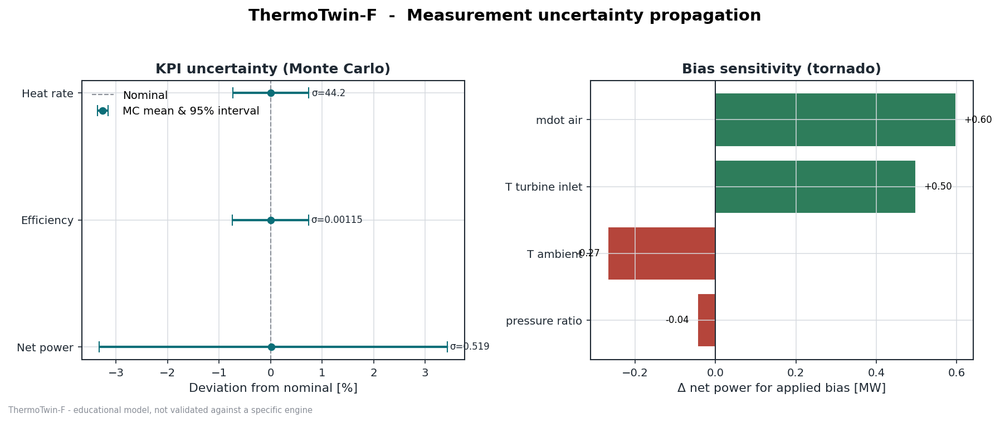

# ThermoTwin-F

[](https://github.com/abhijith-sivaprasadan/thermotwin/actions/workflows/ci.yml)
[](LICENSE)
[](https://fortran-lang.org)
[](https://github.com/abhijith-sivaprasadan/thermotwin/releases)

> **Citation and DOI:** The software citation and researcher ORCID are in [`CITATION.cff`](CITATION.cff). Find the exact tagged source at [GitHub Releases](https://github.com/abhijith-sivaprasadan/thermotwin/releases). A Zenodo DOI badge/link will be added **only once an archived DOI has actually been issued**; the presence of this citation file alone is not a minted DOI.

**A Modern Fortran gas-turbine and combined-cycle performance simulator —
design, degradation, transient thermal response, measurement uncertainty,
inverse diagnostics, data reconciliation, and OPC UA integration.**

ThermoTwin-F models a single-shaft, open/simple Brayton-cycle gas turbine —
with an optional combined-cycle extension (HRSG + steam bottoming) — and
follows the real workflow of a performance engineer across an engine's life:

1. **Design** — establish the clean design point and its off-design sensitivities.
2. **Monitor** — quantify how fouling, erosion, and pressure losses degrade performance.
3. **Diagnose** — given noisy plant measurements, infer *where* an engine has degraded.

The whole project is built around a single shared data model — one `InputCase`
(machine + operating point) flows in, one `CycleResult` (every station state and
KPI) flows out — so the advanced modules compose coherently instead of being
independent scripts.

## Software release and citation

ThermoTwin-F is **open research software** (MIT licensed). The `v2.0.0-beta.1`
edition is intended as an **educational source-code prerelease**, not a qualified
industrial performance predictor. The native Windows GUI is **experimental**:
its compilation is covered by CI, but end-to-end interaction, OPC UA operation
and binary redistribution are not yet accepted. No new GUI executable is
included in the source-only prerelease.

**Creator:** Abhijith Sivaprasadan ·
[ORCID 0000-0003-0299-5745](https://orcid.org/0000-0003-0299-5745)

**How to cite:** Use the *version-specific* DOI shown on the corresponding
[Zenodo record](https://zenodo.org/) once the GitHub release has been archived.
The version-specific DOI identifies an immutable software snapshot, whereas
the Zenodo concept DOI represents the evolving software. Until a DOI is minted,
cite the precise [GitHub release tag](https://github.com/abhijith-sivaprasadan/thermotwin/releases)
or Git commit, together with `CITATION.cff`. We do not invent a DOI or present
GitHub CI as external scientific validation.

**Version evidence:** [release verification run](https://github.com/abhijith-sivaprasadan/thermotwin/actions/runs/40416209807)
(10/10 CI jobs passed on merged preparation commit `f89d03bad5d3304ead88c7420f510494940e5654`),
[release acceptance gates](docs/RELEASE_GATE.md),
[independent reference comparisons](docs/INDEPENDENT_BENCHMARKS.md),
and [draft release notes](docs/RELEASE_NOTES_v2.0.0-beta.1.md).
Verify the checks for the **exact tag commit** before citing any release.

## Results at a glance

*Illustrative figures from tracked example outputs, not experimentally validated
plant measurements or independently audited release-version results.*

<table>
<tr>
<td align="center"><b>Design-point cycle</b><br></td>
<td align="center"><b>Degradation impact</b><br></td>
</tr>
<tr>
<td align="center"><b>Inverse diagnostics</b><br></td>
<td align="center"><b>Measurement uncertainty</b><br></td>
</tr>
</table>

---

> **Honesty note.** This is a non-proprietary **educational** simulator built on
> standard textbook thermodynamics with representative property values. It is
> **verified** against an independent hand calculation (`thermotwin selftest`)
> but is **not validated** against any specific commercial engine and is **not**
> ASME PTC 22 / ISO 2314 compliant. Treat the numbers as physically plausible
> illustrations, not predictions for a particular machine. See
> [the consolidated technical report](docs/THERMOTWIN-F_TECHNICAL_REPORT.md).

---

## Quick start

You need a Fortran compiler (`gfortran` ≥ 9) and, for the plots, `python3` with
`numpy` and `matplotlib`.

### Reference path — gfortran + Make

```bash
make
make check
```

See the [verification matrix](docs/verification_matrix.md) for numerical oracles,
tolerances and the stable/experimental boundary.

### Experimental alternative — Fortran Package Manager (unverified)

FPM is not a supported primary path until the expanded engine passes build/test
parity. The retained manifest and commands below are development candidates only.

```bash
fpm build
fpm test
```

The primary supported build/test path is still `make` and `make check`.
The compatibility build wrapper now delegates to the Makefile, and the
`run_pipeline.sh` report-regeneration path has passed a CI smoke test.
This establishes that the pipeline executes, **not** that every plotted value
has been independently benchmarked.

```bash
./scripts/build.sh            # build ./thermotwin
./scripts/run_tests.sh        # build + run all unit tests + selftest
./scripts/run_pipeline.sh     # build, run every mode, make figures + PDF report
```

A `Makefile` is also provided (`make`, `make check`, `make run`, `make debug`).

### See everything at once

```bash
./scripts/run_pipeline.sh
```

This produces all result CSVs in `output/`, six figures in `output/figures/`,
and a multi-page report at `output/ThermoTwin-F_report.pdf`.

### Optional Windows grid-balancing GUI

The repository also includes an optional native Windows GUI written in Fortran. It
uses a custom-drawn Win32/GDI dashboard through `iso_c_binding`, links directly
to the simulator modules, and lets you manipulate demand, renewables, storage,
gas dispatch, ambient temperature, and firing temperature while watching live
grid balance, battery state of charge, frequency estimates, reserves, and
rolling time-series traces. The dashboard also includes basic operating
economics and battery ROI estimates, uses buffered GDI rendering to keep timer
updates smooth, and embeds a generated Windows icon for the executable.

```powershell
make download-opcua   # pinned open62541; requires network access
make gui
.\thermotwin-gui.exe
```

See [`gui/README.md`](gui/README.md) for scope and
[the GUI acceptance protocol](docs/GUI_ACCEPTANCE.md). The GitHub Actions
Windows job only **compiles** the GUI; the source-code prerelease must not
be advertised as a qualified binary distribution.

---

## Command-line modes

```
thermotwin run         <input.csv> [output.csv]   solve every row of a case file
thermotwin degradation <baseline.csv>             clean/mild/severe/washed comparison
thermotwin transient   <baseline.csv>             startup/load-ramp/shutdown metal heating
thermotwin uncertainty <baseline.csv>             Monte Carlo + bias-sensitivity study
thermotwin diagnostics <baseline.csv>             recover a known degradation by inversion
thermotwin selftest                               verify against the hand calculation
```

`run` evaluates every operating point in the file (a single design point and a
30-row parameter sweep are handled identically). The scenario modes take the
first row of their file as the baseline machine.

---

## What it computes

- **Cycle solver** — full station-by-station solution (compressor, combustor,
  turbine, shaft/generator) with a rigorous fuel-mass-conserving combustor
  energy balance; outputs power, thermal efficiency, heat rate, exhaust
  temperature and energy, specific power, and a converged/sanity flag.
- **Degradation** — four interpretable knobs (compressor fouling, mass-flow
  loss, turbine erosion, combustor ΔP rise) applied to the clean case and
  re-solved, so all KPI changes are emergent.
- **Transient thermal** — lumped-capacitance metal node driven by the cycle's
  exhaust temperature, integrated with Euler and RK4.
- **Sensor + uncertainty** — bias/noise/drift measurement model, Monte Carlo
  KPI uncertainty, and a deterministic bias-sensitivity tornado.
- **Inverse diagnostics** — weighted least-squares estimation of the degradation
  state from observed KPIs (grid search + coordinate-descent refinement).
- **Combined-cycle bottoming** — single-pressure HRSG (pinch/approach-limited
  0-D heat balance) driving a steam bottoming cycle with a condenser
  back-pressure correlation against ambient temperature.
- **Data reconciliation** — single-constraint weighted least-squares
  reconciliation of redundant noisy measurements, with a chi-square(1) global
  test for gross-error detection.
- **OPC UA integration** — an `iso_c_binding` bridge to `open62541` that writes
  named tag values with engineering units to an OPC UA address space; this is
  an optional GUI-side integration, not covered by core CI (see the
  [verification matrix](docs/verification_matrix.md)).

Historical example simple-cycle design-point outputs include **≈30 MW** and
**≈31% thermal efficiency**. These numbers are illustrative model outputs,
**not** a measured industrial baseline or revalidated performance guarantee.

---

## Repository layout

```
thermotwin-f/
├── app/main.f90              CLI driver (all modes)
├── src/                      simulation modules (see below)
├── test/                     unit tests (one program per module) + shared asserts
├── cases/                    CSV inputs + format documentation
├── python/                   matplotlib post-processing + PDF report generator
├── docs/                     theory, equations, verification, limitations, report
├── scripts/                  build.sh, run_tests.sh, run_pipeline.sh
├── output/                   generated CSVs, figures, and the PDF report
├── fpm.toml                  Fortran Package Manager build
├── Makefile                  gfortran build (fpm-free)
└── LICENSE                   MIT
```

### Source modules

The original thermodynamic core includes `fluid_properties`, `compressor`,
`combustor`, `turbine`, `cycle_solver`, `hrsg`, `steam_cycle`,
`degradation`, and `diagnostics_solver`. Newer modules also cover exergy,
reconciliation, sensitivity and Monte Carlo analysis, transient behaviour,
grid/fleet scenarios and demonstrator machine-learning models. Consult the
**current** `Makefile` source inventory rather than an old partial module
list when extending the dependency graph.

---

## Documentation

| Document | Contents |
|---|---|
| [`docs/THERMOTWIN-F_TECHNICAL_REPORT.md`](docs/THERMOTWIN-F_TECHNICAL_REPORT.md) | consolidated equations, assumptions, analysis and verification discussion |
| [`docs/REVAMP_7.0.md`](docs/REVAMP_7.0.md) | implementation history; roadmap aspirations are not independent validation |
| [`docs/COMMIT_REVIEW.md`](docs/COMMIT_REVIEW.md) | current checks and remaining verification boundaries |
| [`cases/README.md`](cases/README.md) | input CSV column format |
| [`docs/INDEPENDENT_BENCHMARKS.md`](docs/INDEPENDENT_BENCHMARKS.md) | external CoolProp IF97 accuracy comparison and standalone TESPy Rankine reference |
| [`docs/RELEASE_EVIDENCE_2026-10-26.md`](docs/RELEASE_EVIDENCE_2026-10-26.md) | commit-scoped CI and numerical benchmark evidence |
| [`docs/RELEASE_GATE.md`](docs/RELEASE_GATE.md) | source prerelease criteria and Zenodo steps |
| [`docs/GUI_ACCEPTANCE.md`](docs/GUI_ACCEPTANCE.md) | Windows GUI/OPC UA manual acceptance cases |
| [`docs/THIRD_PARTY_NOTICES.md`](docs/THIRD_PARTY_NOTICES.md) | optional reference packages and OPC UA licensing obligations |

---

## Design choices worth noting

- **Modern Fortran (2008):** free-form, `implicit none` everywhere, modules and
  derived types, descriptive unit-suffixed variable names, doc comments.
- **One data model:** `InputCase` and `CycleResult` are the contract every
  module speaks, which is what lets degradation/sensors/uncertainty/diagnostics
  interoperate.
- **Switchable fluid properties:** constant `cp`/`γ` by default (so the hand
  calculation is exactly reproducible), with a temperature-dependent option
  behind the same interface.
- **Reproducibility:** the RNG is explicitly seeded, so Monte Carlo studies
  repeat exactly.
- **Tested physics, not just syntax:** unit tests check energy balance,
  monotonic degradation, transient steady-state limits against an analytic
  oracle, and recovery of a known degradation by the inverse solver.

---

## Scientific scope and independent benchmarking

The variable-property mode uses NASA seven-coefficient gas heat-capacity terms
and **approximate** water/steam correlations (the legacy `if97_*` function names
are not a claim of IAPWS-IF97 compliance). These are useful engineering teaching
models, not a substitute for a certified property package. See
[the scientific accuracy and benchmarking protocol](docs/INDEPENDENT_BENCHMARKS.md)
and [the release gates](docs/RELEASE_GATE.md). An optional external comparison
uses CoolProp's actual IF97 backend without copying its source code.
At nine benchmark pressures the approximate saturation temperature had a
**0.53 K mean absolute error**, while saturated-vapour enthalpy showed a
**104 kJ/kg mean absolute error** and superheated enthalpy a **216 kJ/kg mean
absolute error** (the latter includes differences in state definitions).
See the complete [benchmark report](docs/INDEPENDENT_BENCHMARKS.md).
A completed benchmark is not evidence of full IAPWS-IF97 conformity.

The advanced grid, ML, emissions and dispatch demonstrations use representative
and/or synthetic inputs; passing scenario tests is not experimental validation.
The historical technical monograph must not be represented as independently
validated results from the DOI release. The PDF-report generation pipeline
has passed a functional smoke test, but that does not constitute a full
numerical reproduction and uncertainty audit.

## Roadmap

Prioritize independent thermophysical and whole-cycle benchmarks, numerical
sensitivity and conservation audits, verified GUI/OPC UA acceptance, and
reproducible scientific reports before further expanding the model.

---

## License

Optional neural-surrogate weights are loaded from `dnn_weights.txt`. Regenerate them
with `python train_dnn.py` (NumPy required). Training targets are synthetic model
outputs, not measured plant observations; surrogate agreement is not external validation.

MIT — see [`LICENSE`](LICENSE).

## Parallel execution and CI

Optional OpenMP batch operating-point evaluation with serial equivalence checks and measured workstation scaling. See [docs/openmp_scaling.md](docs/openmp_scaling.md).

CI runs on Ubuntu, Windows and macOS. ThermoTwin-F uses release/debug profiles and serial/OpenMP builds. Weekly runs check dependency drift. Hosted run status is available in the repository’s Actions tab; documented local measurements are separate from hosted verification.
